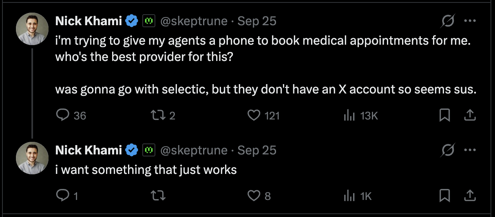

I went to get a skin analysis done thru [@layersbio](https://x.com/layersbio) and it came back with a bunch of areas for improvement that i wanted to action on which required getting some prescriptions. I started booking appointments to get those and was immediately frustrated that my agents couldn't call to do it for me. So, naturally, I tweeted asking for a product to solve this.



To my immense disappointment, there wasn't anyone who had built this yet. I got a few replies from devtool style companies that had made voice AI APIs, but I really just wanted a managed solution and couldn't find one. I figured that there were enough other people similar to me who use a lot of agents but didn't like making phone calls that I decided it was actually worth building the tool myself and launched [call4me](https://call4.me). Based on the revenue, I feel like that instinct was correct!


## What it does

You add one MCP URL to your agent. Then you say something like "call my dentist and move my cleaning to next week, any morning works" and the agent does the rest.

The important design decision is that **the caller can only say what it was given**. A phone call is a terrible place to discover you don't know the patient's date of birth. So before dialing, the agent has to collect everything the call will need:

- A saved profile with the stuff businesses always ask for: legal name, date of birth, phone, address, insurance, car.
- Per-call requirements by category. There are 12 of them (medical, dental, restaurant, vet, auto service, internet, flight change, and so on), and each lists the fields that kind of business will ask for.

If something is missing, `call4me_place_call` refuses with "Not calling yet" and lists exactly what to ask the user. The agent asks, retries, and only then does the phone ring.

During the call the agent polls for progress. If the business asks something the caller doesn't know, the question shows up for the agent, the agent asks me, and my answer gets spoken on the call. If the business insists on talking to me, my phone rings, I press 1 to join, and I press star to hand the call back. After hangup, a recap written from the transcript lands in the agent's context.

## The architecture

```
agent ──MCP──▶ worker ──POST /v2/calls──▶ Telnyx ──PSTN──▶ business
                  ▲                          │ media stream (μ-law, bidirectional)
                  │ webhooks                 ▼
                  └──────── VoiceSession (Durable Object) ◀──WS──▶ GPT-Live
                                                                    └─ back office (gpt-5.5):
                                                                       end_call · ask_user
                                                                       press_digits · connect_person
```

Everything runs on Cloudflare. The site, MCP server, API and webhooks are one Worker. Calls run in a separate Worker, where every live call is its own Durable Object. D1 holds accounts, calls and an append-only credits ledger. Stripe handles payments.

### Telnyx and GPT-Live speak the same audio

The part I'm happiest with is how little the audio path does. Telnyx Call Control places the call and opens a two-way media stream over a WebSocket. GPT-Live accepts audio in G.711 μ-law at 8 kHz, which is exactly what a phone line already carries. So the Durable Object just relays frames in both directions, untouched.

There's no speech-to-text step, no text-to-speech step, and no resampling. Every stage you skip is latency you don't pay and a failure mode you don't have. The voice model hears the phone line exactly as it is, hold music and all.

One small detail that mattered: the GPT-Live session starts when Telnyx says the call was answered, not when we dial. Otherwise the model sits there listening to ringback and gets confused about whether someone is on the line.

### Not a cascaded voice stack

Most voice agents are cascaded: speech-to-text transcribes the other side, an LLM writes a reply, and text-to-speech reads it out. call4me isn't. There is exactly one model on the audio path, GPT-Live, and it hears audio and speaks audio directly. The text model further down this post only makes decisions. It never sits between the business and the voice.

Cascades are popular because every piece is swappable and the LLM in the middle is a normal text model that's good at tools. But each hop adds latency, and turning speech into text throws away everything that isn't words: tone, hesitation, someone talking over you, the difference between hold music and silence. On a phone call those are most of the signal.

Going speech-to-speech has worked out well. Interruptions mostly handle themselves. GPT-Live stops talking when it's talked over, and the only thing I had to add was flushing audio that was already queued at Telnyx, so the business doesn't hear the end of a sentence the model already abandoned. Cost isn't a blocker either: GPT-Live costs about 5¢ a minute, a small slice of the 25¢ a minute call4me charges.

The real tradeoffs are the ones the rest of this post is about. A realtime model is worse at acting reliably than a text model, so it doesn't get tools. It only speaks when it hears something, so silence while it waits on me is my problem to fill. If you're weighing a switch away from a cascade, those are the two things to plan for.

### The voice model doesn't hold the tools

GPT-Live is great at conversation and bad at being trusted with side effects. So it doesn't get any tools. Instead it delegates to a "back office": a regular Responses API model that owns everything that changes the world. The session config looks like this:

```ts
this.sendLive({
  type: "session.start",
  session: {
    model: "gpt-live-1",
    instructions,
    audio: { format: { type: "audio/pcmu", rate: 8000 }, output: { voice: s.voice } },
    delegation: {
      type: "responses",
      responses: {
        model: "gpt-5.5",
        instructions: s.backOffice,
        tools: BACK_OFFICE_TOOLS, // end_call, ask_user, press_digits, connect_person
        parallel_tool_calls: false,
        reasoning: { effort: "low" },
        text: { verbosity: "low" },
      },
    },
  },
});
```

The voice keeps talking while the back office thinks. When the business says "can I get the account holder's zip code?" and the caller doesn't have it, the voice says something natural, and the back office calls `ask_user`. That question goes out over MCP to my agent, my agent asks me, and my answer gets injected straight back into the voice model to say out loud.

This split is the whole product. The fast model handles the conversation and the smart model handles decisions.

## Navigating phone menus

Most calls to a big company never reach a person without getting through a phone menu first. This was by far the hardest part to get right, and most of the code in the voice folder exists because of it.

### Saying "2" out loud does nothing

The first bug was funny. A menu says "for billing, press 2" and GPT-Live confidently says "2." out loud. A phone menu only hears the keypad, so it repeats itself, the model says "2." again, and you get a loop that runs until the menu hangs up.

The voice model is supposed to delegate to the back office, which calls `press_digits`. Sometimes it just doesn't. No delegation event, no error, nothing runs. Same thing with "let me check on that real quick" followed by silence, or "bye!" followed by never actually hanging up.

I couldn't make the model reliable, so the session watches the transcript itself. A set of patterns spots phone menus and spoken promises:

```ts
const KEYPAD_MENU = [
  new RegExp(String.raw`\bpress(?:ing)?\s+${KEY}\b`, "i"),
  new RegExp(String.raw`\bdial\s+${KEY}\b`, "i"),
  /\bmenu options\b/i,
  /\bappuyez\b[^.?!]{0,30}\b(?:sur|le)\b/i, // French menus too
];

const PROMISES = [
  /\b(?:let me|lemme) (?:check|see|look|find out)\b/i,
  /\bhang on\b/i,
  /\b(?:good)?bye\b/i,
];
```

If a menu finishes speaking (3 seconds of quiet) or the caller makes a promise (1.5 seconds) and no hand-off follows, the session starts the back office on its own and tells it what was missed.

### Recovering from dead ends

Getting the first key right isn't enough. Menus lead to dead ends: "no input was received", "that selection is not valid", or worst of all, "please visit our website" and a hangup.

A `MenuRecovery` class tracks fresh menu speech separately from the transcript, remembers every key the carrier accepted and what prompt it was answering, and watches for failure phrases. When a menu fails, the back office gets the full key history and one firm rule: never repeat a route that didn't work. Back out to the main menu, try "other questions", try for a representative.

Speech-driven menus were their own problem. FPL and UPS both looped for about 8 minutes before I taught the caller the magic words: say "representative", and if that doesn't work, say "agent".

### Keypresses that don't make it overseas

Telnyx's `send_dtmf` sends keypresses as out-of-band RFC 2833 events. That works for US phone menus. On a call to Dubai Opera, the menu just kept repeating, because the UAE route was stripping those events.

The fix was to stop asking the carrier to press keys and press them ourselves. For any number outside +1, the caller now plays real keypad tones into its own audio: two sine waves per key, 120 ms of tone and 80 ms of gap, encoded to μ-law and spliced into the outgoing frames. A tone inside the voice audio survives any route that carries the voice.

## The other things that broke

### Deploys killed live calls

A Durable Object can be reset when you deploy. On launch day, every call that went deaf was one of those resets. The fixes stacked up: a 20 second heartbeat that asks Telnyx to reattach the stream, resuming GPT-Live with the transcript so far so it doesn't greet the business twice, and treating "no audio 4 seconds after pickup" as a lost stream.

The real fix came after a blog deploy cut off a user's demo call mid-sentence. Calls now live in their own Worker, and the deploy script for that Worker only ships when the bundle actually changed and no call is live.

### Patching me into the call

The first version dialed me in as a Telnyx supervisor with full speaking rights. My voicemail picked up, its greeting played onto the business's line, the voicemail hanging up looked like me handing the call back, and the system rang me again. In a loop.

Now my phone rings listen-only and I have to press 1 to join. If 30 seconds pass with no keypress, it's voicemail. Once I'm on, my own keypresses get forwarded to the business too. I found that one the hard way when the Experian menu asked for my SSN and my keypad did nothing.

### Silence while waiting on me

The voice model only speaks when it hears something. So when it asked me for a one-time code and was waiting on my answer, the line went dead. A Spectrum rep sat through 41 seconds of silence. Now, every 15 seconds or so, the caller says "sorry, still checking on that, one sec" until the answer arrives.

## What I'd tell someone building this

- **Skip every audio conversion you can.** Matching the carrier's codec end to end made the audio path the most boring part of the system, which is exactly what you want.
- **Split the voice from the decisions.** A realtime model with tools will press the wrong button eventually. A realtime model that delegates to a reasoning model is much easier to control.
- **Don't trust the model to act. Verify.** The most valuable code in the repo is a few regexes that notice when the voice said it would do something and didn't.
- **Gather everything before you dial.** The caller can only say what it was given.

You can try it at [call4.me](https://call4.me). Calls are 25¢ per minute, and unanswered calls are free.
